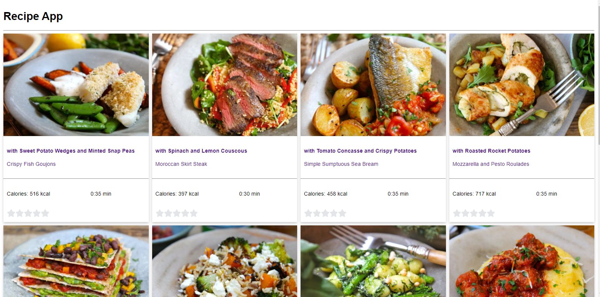
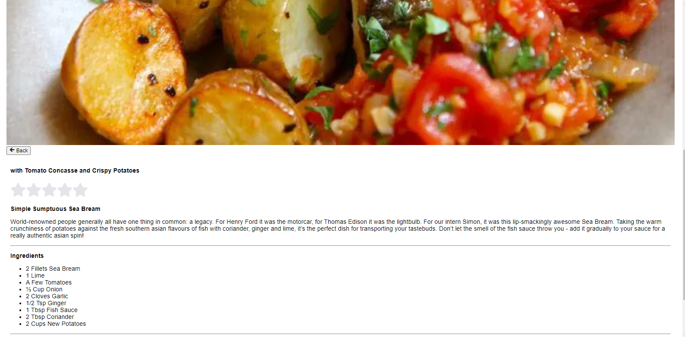

`Here is the all recipes Overview and details page`

 # Technologies I have used
React js, redux, redux-saga, axios and jest enzyme.

First install node_modules by
### `npm install`

Then run the app by following command
### `npm start`

It will start on port 3000

Run test this by
### `npm test`

Please see the `screenshot` to see the view

